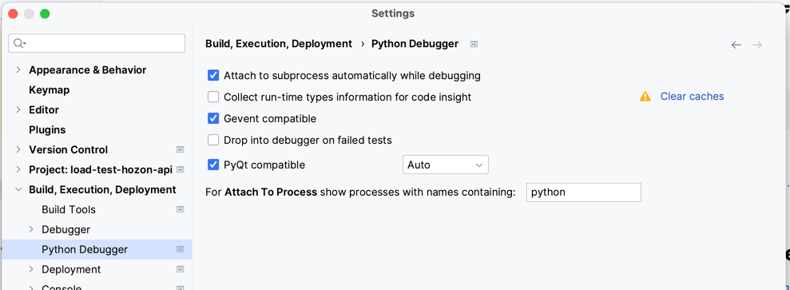

# Locust-Sensenova Project

## Install Dependencies
```shell
pip install -r requirements.txt
```

## Debugging your Locustfile
Reference: https://docs.locust.io/en/stable/running-in-debugger.html


## Start Headless Locust
Test SenseChat API Only:
```shell
LOAD_TEST_TOKEN='xxxxxx' locust --headless -H https://example.com --users 1 --only-summary --tags sense_chat
```